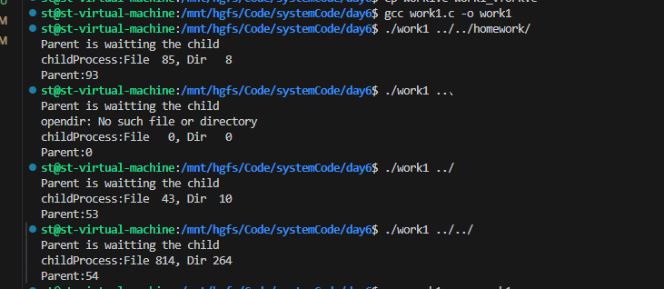
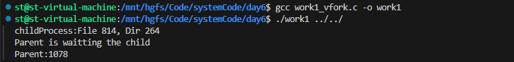
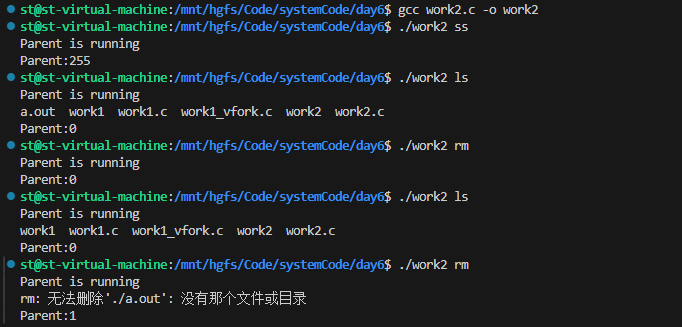
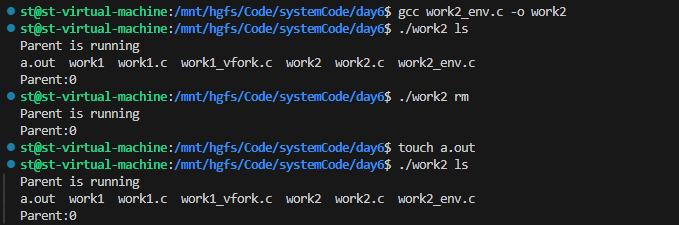

# 作业1

## 1-1.使用返回值返回

**（返回值范围为0-255，超过会阶段，文件多时结果错误）**



```c
#include <unistd.h>
#include <sys/types.h>
#include <stdio.h>
#include <dirent.h>
#include <string.h>
#include <stdlib.h>
#include <sys/wait.h>

// 统计子目录和文件数量
int countNum(const char* filePath,int *numFile,int* numDir);
// 判断当前目录是否为空，是的话返回1，否则返回0
int isEmpty(const char* filePath);

int main(int argc,char** argv)
{
    if(argc < 2)
    {
        fprintf(stderr,"Usage <%s> filePath\n",argv[0]);
        return -1;
    }

    // 创建进程使用返回值进行统计,linux中退出码范围为0-255，超出会被截断(%255)，只能用来统计数量较少目录
    pid_t cpid = fork(); 
    if(cpid < 0)
    {
        perror("fork");
        return -1;
    }else if(cpid == 0)
    {
        //子进程
        int numFile=0,numDir=0;
        countNum(argv[1],&numFile,&numDir);
        printf("childProcess:File %3d, Dir %3d\n",numFile,numDir);
        // 进程退出
        exit((numDir+numFile));
    }
    else
    {
        //父进程
        printf("Parent is waitting the child\n");
        int totalNum = 0;
        wait(&totalNum);
        printf("Parent:%d\n",WEXITSTATUS(totalNum));
    }
    return 0;
}

// 统计子目录和文件数量
int countNum(const char* filePath,int *numFile,int* numDir)
{
    DIR* dr = opendir(filePath);
    if(dr == NULL)
    {
        perror("opendir");
        return -1;//目录不存在
    }
    // 遍历目录
    struct dirent* fd = NULL;
    while(fd = readdir(dr))
    {
        if(strcmp(fd->d_name,".")==0 || strcmp(fd->d_name,"..")==0)
            continue;
        if(fd->d_type == DT_DIR)
        {
            // 目录，递归
            (*numDir)++;
            char nextPath[255]={0};
            sprintf(nextPath,"%s/%s",filePath,fd->d_name);
            countNum(nextPath,numFile,numDir);
        }else if(fd->d_type == DT_REG)
        {
            // 文件，记录
            (*numFile)++;
        }
    }

    return 0;
}

// 判断当前目录是否为空，是的话返回1，否则返回0
int isEmpty(const char* filePath)
{
    DIR* dr = opendir(filePath);
    if(dr == NULL)
    {
        perror("opendir");
        return -1;//目录不存在
    }
    // 遍历目录
    int count = 0;
    struct dirent* fd = NULL;
    while(fd = readdir(dr))
    {
        if(strcmp(fd->d_name,".") || strcmp(fd->d_name,".."))
            continue;
        count++;
    }
    if(count==0) return 1;
} 
```

## 1-2 使用vfork+变量

**（类似父子进程共享变量，可正确返回多文件情况，但似乎不安全？）**



```c
#include <unistd.h>
#include <sys/types.h>
#include <stdio.h>
#include <dirent.h>
#include <string.h>
#include <stdlib.h>
#include <sys/wait.h>

// 统计子目录和文件数量
int countNum(const char* filePath,int *numFile,int* numDir);
// 判断当前目录是否为空，是的话返回1，否则返回0
int isEmpty(const char* filePath);

int main(int argc,char** argv)
{
    if(argc < 2)
    {
        fprintf(stderr,"Usage <%s> filePath\n",argv[0]);
        return -1;
    }

    // 子进程和父进程对同一进程进行操作，实现类似“共享”的操作，统计数据可超出255
    
    int numFile=0,numDir=0; //创建一个变量，允许子进程对其操作，(不安全行为？)
    pid_t cpid = vfork(); 
    if(cpid < 0)
    {
        perror("fork");
        return -1;
    }else if(cpid == 0)
    {
        //子进程
        countNum(argv[1],&numFile,&numDir);
        printf("childProcess:File %3d, Dir %3d\n",numFile,numDir);
        // 进程退出
        _exit(0);
    }
    else
    {
        //父进程
        printf("Parent is waitting the child\n");
        int totalNum = numFile + numDir;
        wait(NULL);
        printf("Parent:%d\n",totalNum);
    }
    return 0;
}

// 统计子目录和文件数量
int countNum(const char* filePath,int *numFile,int* numDir)
{
    DIR* dr = opendir(filePath);
    if(dr == NULL)
    {
        perror("opendir");
        return -1;//目录不存在
    }
    // 遍历目录
    struct dirent* fd = NULL;
    while(fd = readdir(dr))
    {
        if(strcmp(fd->d_name,".")==0 || strcmp(fd->d_name,"..")==0)
            continue;
        if(fd->d_type == DT_DIR)
        {
            // 目录，递归
            (*numDir)++;
            char nextPath[255]={0};
            sprintf(nextPath,"%s/%s",filePath,fd->d_name);
            countNum(nextPath,numFile,numDir);
        }else if(fd->d_type == DT_REG)
        {
            // 文件，记录
            (*numFile)++;
        }
    }

    return 0;
}

// 判断当前目录是否为空，是的话返回1，否则返回0
int isEmpty(const char* filePath)
{
    DIR* dr = opendir(filePath);
    if(dr == NULL)
    {
        perror("opendir");
        return -1;//目录不存在
    }
    // 遍历目录
    int count = 0;
    struct dirent* fd = NULL;
    while(fd = readdir(dr))
    {
        if(strcmp(fd->d_name,".") || strcmp(fd->d_name,".."))
            continue;
        count++;
    }
    if(count==0) return 1;
} 
```

# 作业2

## 2-1参数罗列



返回值255（-1）表示子进程异常终止

```c
#include <unistd.h>
#include <sys/types.h>
#include <stdio.h>
#include <dirent.h>
#include <string.h>
#include <stdlib.h>
#include <sys/wait.h>

int main(int argc,char** argv)
{
    if(argc < 2)
    {
        fprintf(stderr,"Usage <%s> operation\n",argv[0]);
        return -1;
    }

    pid_t cpid = fork(); 
    if(cpid < 0)
    {
        perror("fork");
        return -1;
    }else if(cpid == 0)
    {
        //子进程
        // 直接在此处进行判断，来决定子进程执行什么
        if(strcmp(argv[1],"ls")==0)
        {
            // ls操作
            execlp("ls","ls","./",NULL);
        }else if(strcmp(argv[1],"rm")==0)
        {
            // rm操作
            execlp("rm","rm","./a.out",NULL);
        }
        // 正常执行的话，此处不会执行
        exit(-1);
    }
    else
    {
        //父进程
        printf("Parent is running\n");
        int res = 0;
        wait(&res);
        printf("Parent:%d\n",WEXITSTATUS(res));
    }
    return 0;
}
```

## 2-2 参数数组



```c
#include <unistd.h>
#include <sys/types.h>
#include <stdio.h>
#include <dirent.h>
#include <string.h>
#include <stdlib.h>
#include <sys/wait.h>

int main(int argc,char** argv)
{
    if(argc < 2)
    {
        fprintf(stderr,"Usage <%s> operation\n",argv[0]);
        return -1;
    }

    pid_t cpid = fork(); 
    if(cpid < 0)
    {
        perror("fork");
        return -1;
    }else if(cpid == 0)
    {
        //子进程
        // 直接在此处进行判断，来决定子进程执行什么
        if(strcmp(argv[1],"ls")==0)
        {
            // ls操作
            char * const oper[]={
                "ls","./",NULL
            };
            //execlp("ls","ls","./",NULL);
            execvp("ls",oper);
        }else if(strcmp(argv[1],"rm")==0)
        {
            // rm操作
            char * const oper[]={
                "rm","./a.out",NULL
            };
            //execlp("rm","rm","./a.out",NULL);
            execvp("rm",oper);
        }
        // 正常执行的话，此处不会执行
        exit(-1);
    }
    else
    {
        //父进程
        printf("Parent is running\n");
        int res = 0;
        wait(&res);
        printf("Parent:%d\n",WEXITSTATUS(res));
    }
    return 0;
}

```

