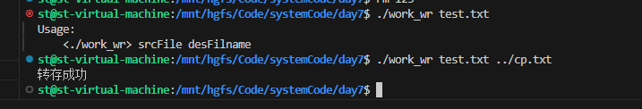

# 1.work1

父进程通过环境变量传递命令行参数（父进程得到的拷贝路径），父子进程通过有名管道通信，结构体Packet用来传输数据，同时用来子进程判断数据是否发送完毕（len=0）



## 1.1 写进程

```c
#include <sys/types.h>
#include <sys/stat.h>
#include <stdio.h>
#include <unistd.h>
#include <string.h>
#include <fcntl.h>
#include <sys/wait.h>


#define FIFO_PATH "/tmp/fifo"
// 数据传输结构体
typedef struct {
    int len;
    char buf[256];
} Packet;


int main(int argc,char** argv)
{
    if(argc < 3)
    {
        fprintf(stderr,"Usage:\n    <%s> srcFile desFilname\n",argv[0]);
        return -1;
    }

    // 1.打开源文件
    int fd = open(argv[1],O_RDWR);
    if(-1 == fd)
    {
        perror("open");
        return -1;
    }

    // 2.创建子进程
    pid_t cpid = fork();
    if(cpid < 0)
    {
        perror("fork");
        return -1;
    }else if(cpid == 0)
    {
        // 3.子进程
        char envpBuf[50]={"DESFILENAME="};
        strcat(envpBuf,argv[2]);
        // 创建子进程，并传递desFilname
        char *const envp[]={
            envpBuf,
            NULL
        };
        char *const argp[]={
            "./work_rd",
            NULL
        };
        if(-1 == execve("./work_rd",argp,envp))
        {
            perror("execve");
            return -1;
        }
    }else{
        // 4.父进程
        // 4.1创建管道,4读，2写，1执行
        if(-1 == mkfifo(FIFO_PATH,0644))
        {
            perror("mkfifo");
            close(fd);
            return -1;
        }
        int fd_fifo = open(FIFO_PATH,O_RDWR);
        // 4.2父进程发送数据
        Packet sendData;
        sendData.len = 0;
        while(1)
        {
            sendData.len = read(fd,sendData.buf,sizeof(sendData.buf));
            // 写入管道
            write(fd_fifo,&sendData,sizeof(sendData));
            // 读取到文件末尾
            if(sendData.len == 0) break;
        }

        // 4.3父进程等待子进程接受数据
        int status = 0;
        wait(&status);
        if(WEXITSTATUS(status) == 0)
        {
            printf("转存成功\n");
        }else 
            printf("转存失败\n");
        close(fd_fifo);
    }
    // 5.退出操作
    unlink(FIFO_PATH);
    close(fd);

    return 0;
}
```

## 1.2 读进程

```c
#include <sys/types.h>
#include <sys/stat.h>
#include <stdio.h>
#include <unistd.h>
#include <string.h>
#include <fcntl.h>
#include <sys/wait.h>
#include <stdlib.h>

#define FIFO_PATH "/tmp/fifo"

// 数据传输结构体
typedef struct {
    int len;
    char buf[256];
} Packet;

int main(int argc,char** argv)
{
    // 1.接收传进来的目标文件名
    char *desFilname = getenv("DESFILENAME");

    // 2.创建目标文件
    int fd_write = open(desFilname,O_RDWR | O_CREAT,0644);
    if(fd_write == -1)
    {
        perror("write open");
        exit(-1);
    }

    // 3.打开管道接收文件
    int fd_fifo = open(FIFO_PATH,O_RDWR);
    if(-1 == fd_fifo)
    {
        perror("write fifo open");
        close(fd_write);
        exit(-1);
    }
    Packet revData;
    while(read(fd_fifo,&revData,sizeof(revData)) > 0)
    {
        if(revData.len == 0) break;
        write(fd_write,revData.buf,revData.len);
    }

    //4.结束处理
    close(fd_fifo);
    close(fd_write);
    return 0;
}
```


# 2.work2

## 2.1. POSIX 共享内存操作接口（shm_open 体系）

### 2.1.1 主要函数

| 步骤          | 作用                  | 函数                                                         |
| ------------- | --------------------- | ------------------------------------------------------------ |
| 创建/打开对象 | 获取/创建共享内存对象 | `int shm_open(const char *name, int oflag, mode_t mode);`    |
| 设置大小      | 调整内存区大小        | `int ftruncate(int fd, off_t length);`                       |
| 映射内存      | 映射到进程虚拟空间    | `void *mmap(void *addr, size_t length, int prot, int flags, int fd, off_t offset);` |
| 使用数据      | 读写内存              | 直接操作指针                                                 |
| 解除映射      | 取消内存映射          | `int munmap(void *addr, size_t length);`                     |
| 关闭对象      | 关闭 fd               | `int close(int fd);`                                         |
| 删除对象      | 删除共享内存对象      | `int shm_unlink(const char *name);`                          |

### 2.1.2 操作步骤

1. **创建或打开共享内存对象**
    `int fd = shm_open("/myshm", O_CREAT|O_RDWR, 0666);`
2. **设置共享内存大小**
    `ftruncate(fd, SIZE);`
3. **映射到虚拟内存**
    `void *ptr = mmap(NULL, SIZE, PROT_READ|PROT_WRITE, MAP_SHARED, fd, 0);`
4. **读写内存区**
    直接通过 `ptr` 操作
5. **解除映射**
    `munmap(ptr, SIZE);`
6. **关闭文件描述符**
    `close(fd);`
7. **删除共享内存对象（可选，清理资源）**
    `shm_unlink("/myshm");`

------

## 2.2. System V 共享内存接口

### 2.2.1 主要函数

| 步骤         | 作用              | 函数                                                       |
| ------------ | ----------------- | ---------------------------------------------------------- |
| 生成key      | 生成唯一键        | `key_t ftok(const char *pathname, int proj_id);`           |
| 获取/创建    | 获取/创建共享内存 | `int shmget(key_t key, size_t size, int shmflg);`          |
| 映射到内存   | 连接到进程空间    | `void *shmat(int shmid, const void *shmaddr, int shmflg);` |
| 使用数据     | 读写内存          | 直接操作指针                                               |
| 解除映射     | 断开内存映射      | `int shmdt(const void *shmaddr);`                          |
| 删除共享内存 | 标记删除          | `int shmctl(int shmid, int cmd, struct shmid_ds *buf);`    |

### 2.2.2 操作步骤

1. **生成key**
    `key_t key = ftok("/tmp", 65);`
2. **获取或创建共享内存**
    `int shmid = shmget(key, SIZE, IPC_CREAT|0666);`
3. **连接共享内存到进程地址空间**
    `void *ptr = shmat(shmid, NULL, 0);`
4. **读写内存**
    直接通过 `ptr` 操作
5. **断开映射**
    `shmdt(ptr);`
6. **删除共享内存（标记删除）**
    `shmctl(shmid, IPC_RMID, NULL);`

------

### 2.3. POSIX 与 System V 共享内存对比

| 方面      | POSIX (shm_open)                    | System V (shmget)              |
| --------- | ----------------------------------- | ------------------------------ |
| 标准      | 新标准，类文件操作                  | 传统，SVR4 老接口              |
| 名字      | 以“/”开头的名字，类似文件名         | 需要 key，通常用 ftok 生成     |
| 创建/获取 | shm_open + ftruncate                | shmget                         |
| 内存映射  | mmap（文件映射通用接口）            | shmat                          |
| 解除映射  | munmap                              | shmdt                          |
| 删除      | shm_unlink（名字空间删除）          | shmctl(IPC_RMID)               |
| 权限      | 文件权限（mode_t）                  | shmflg 权限（mode_t）          |
| 管理方式  | 文件描述符、名字（可见于 /dev/shm） | shmid，不在文件系统出现        |
| 跨平台性  | 新系统支持好，代码风格现代          | 老式接口，历史包袱多           |
| 常见路径  | `/dev/shm/yourname`                 | 系统内核分配，不可见于文件系统 |
| 额外操作  | 需 close fd，显式 unlink            | 需 shmctl 删除                 |

